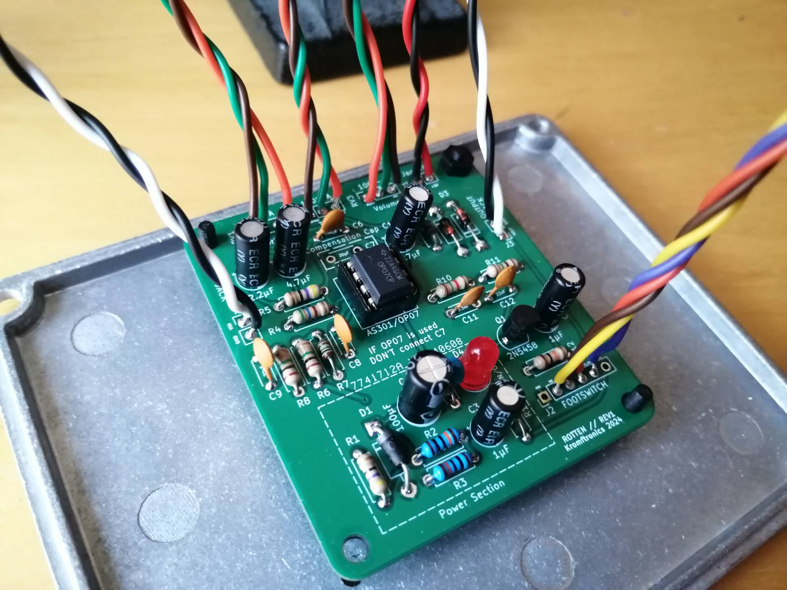
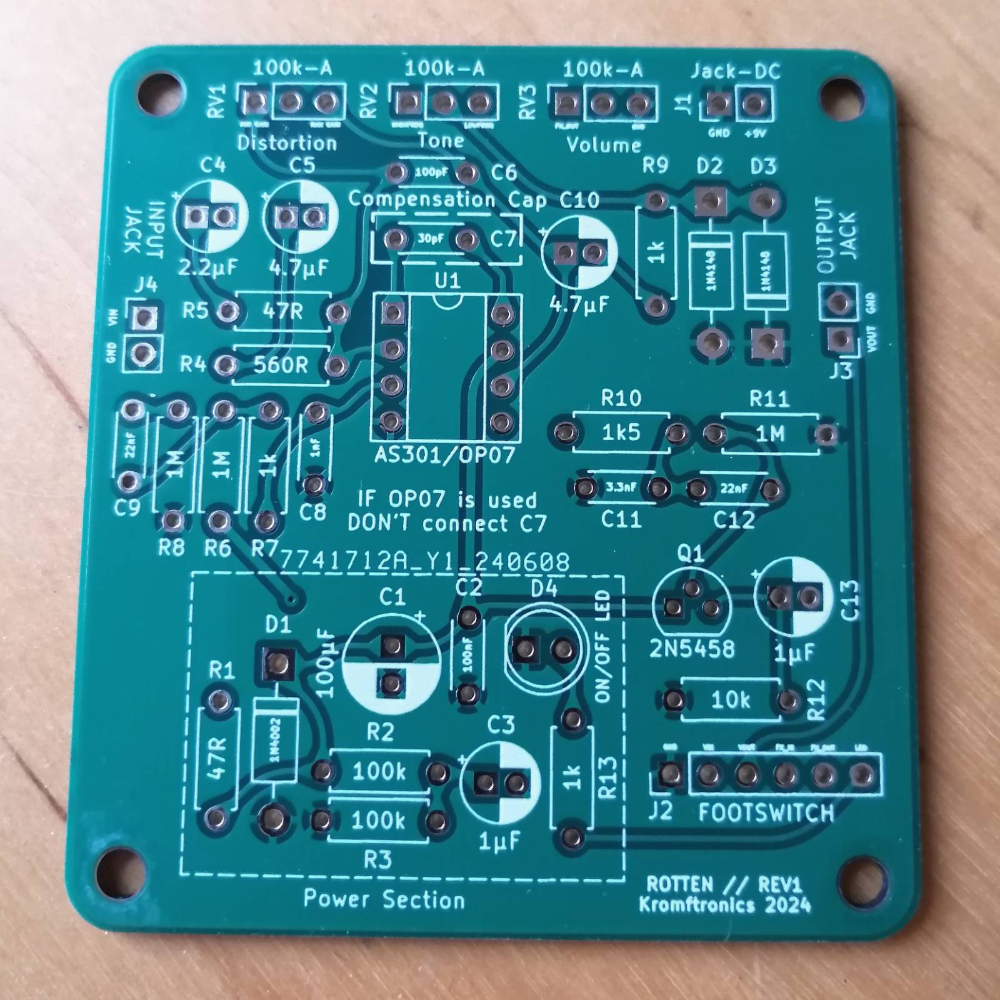
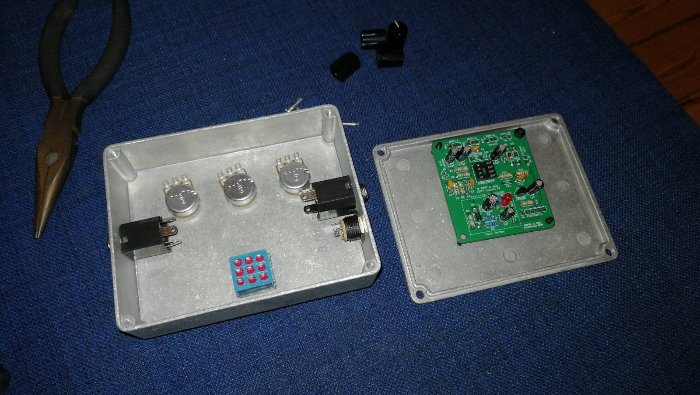
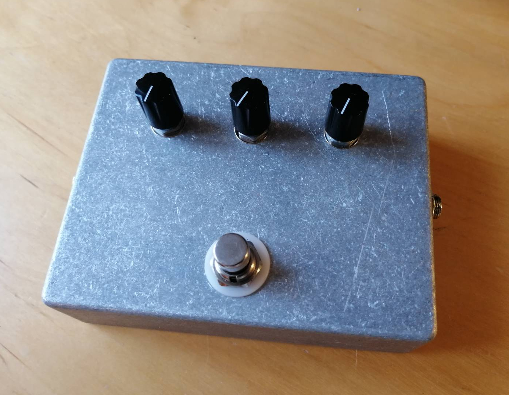

Saturation, overdrive, or distortion is really what makes an electrical guitar come alive. The sound and tone of the guitar can be sculptured and totally change the character of the instrument depending on which saturation is being used. This is also why there exists soooo many overdrive/distortion pedals out there. It is a very personal thing, what distortion pedal that you prefer. Personally, I like things to be a bit fuzzy while still having some overdrive character.

The [Pro Co Rat](https://en.wikipedia.org/wiki/Pro_Co_RAT) is a legendary distortion pedal that IMO has a great "fuzzy" character, but without being a full blown fuzz pedal, which I think sounds really nice. I was considering buying one, but thought that it would be a fun project to try to create my own clone. I named the clone "Rotten" which is the danish word for "the rat", but also sounds cool in English ( ‾ ʖ̫ ‾)

### KiCad Schematic & PCB Design

A quick search around the internet lead to and article from [ElectroSmash](https://www.electrosmash.com/proco-rat). The article includes a schematic and describes how the Pro Co Rat works, which served as the starting point for the clone. Essentially, I have created a PCB in KiCad of the schematic from the ElectroSmash article, which is available on my GitHub for everyone to use. The GitHub repo also includes some information regarding the assembly.

[Link to GitHub Repo](https://github.com/KamikazeVildsvin/Rotten)

The gallery below shows the PCB that I have created and the enclosure that I made. I order all of the components and electro-mechanical hardware from [Banzai Music](https://www.banzaimusic.com/), including the pre-drilled casing.

You should be able to make your own clown by going to the GitHub page and generate the needed Gerber files from the KiCad project. The components are also listed on the interactive BOM on the GitHub repo. I was able to find all of the components at [Banzai Music](https://www.banzaimusic.com/), and most of the components are pretty standard components.
